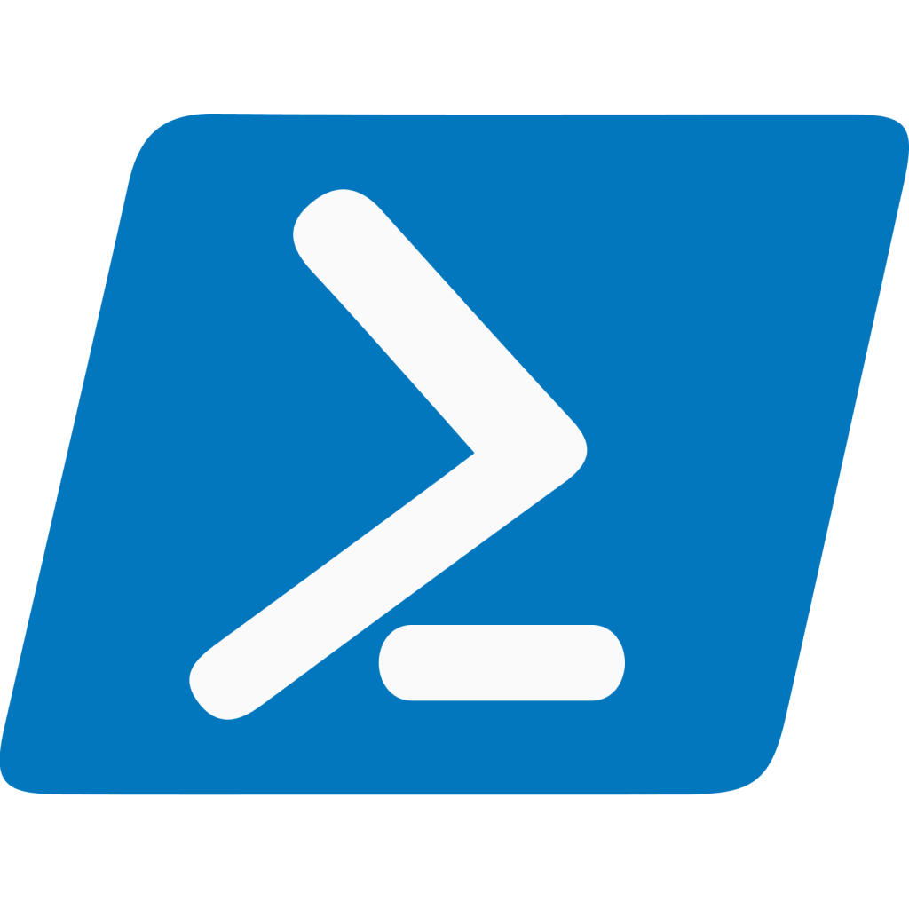

   
   &nbsp;&nbsp;
   

<h1>scripts</h1>

A collection of random, redundantly miscellaneous scripts

 

   
   
   
   

 

A collection of one-off scripts,  Containerfiles (_seriously, stop calling them
Dockerfiles_) and  whatnot for  random thing-doing  and automation  intended to
those lazy and/or brain-saturated. Anything that's not important enough for it
to have its own repository goes here.

As one-shots, these  scripts should (mostly) be dependency-less  so these will
be in either POSIX Shell, PowerShell, or plain Containerfiles.

Feel free to add your own via PR.

